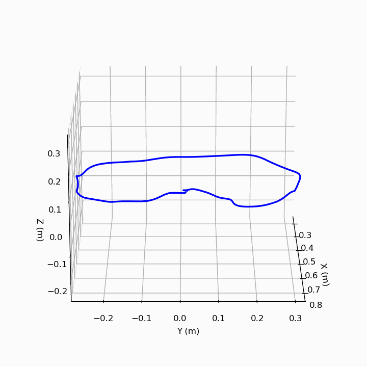

<div align="center">

<h1>🤖 franka_ros2_teleop</h1>

<p><strong>High-frequency leader–follower teleoperation framework for Franka FR3 robots with learning-ready state logging at ~1 kHz.</strong></p>

[](https://docs.ros.org/en/humble/)
[](https://www.docker.com/)
[](LICENSE)
[](https://www.franka.de/)
[](https://www.python.org/)

<br/>

*Kinesthetic teaching · End-effector velocity · Gripper recording · Docker-first · ML-ready*

</div>

---

## 📋 Table of Contents

- [Research Motivation](#-research-motivation)
- [What This Repository Does](#-what-this-repository-does)
- [Design Principles](#-design-principles)
- [Repository Structure](#-repository-structure)
- [Prerequisites — What You Need Before Starting](#-prerequisites--what-you-need-before-starting)
- [Hardware Setup](#-hardware-setup)
- [Quick Start — Step by Step](#-quick-start--step-by-step)
- [Data Collection](#-data-collection)
- [Gripper Control](#-gripper-control)
- [Loading Data in Python](#-loading-data-in-python)
- [Trajectory Visualization](#-trajectory-visualization)
- [Configuration Reference](#-configuration-reference)
- [Reproducibility](#-reproducibility)
- [Troubleshooting](#-troubleshooting)
- [Contributing](#-contributing)
- [Citation](#-citation)

---

## 🔬 Research Motivation

High-frequency kinesthetic demonstrations are critical for:

- Learning stable manipulation policies from human demonstration
- Modeling human teaching intent and motion primitives
- Neural ODE trajectory modeling of continuous robot dynamics
- Safe control synthesis using CLF-CBF constraints
- Imitation learning and behaviour cloning pipelines

This framework captures physically consistent robot state at ~1 kHz during gravity-compensation teaching — ensuring downstream learning algorithms receive **high-fidelity, temporally dense state data** including correct end-effector velocity (computed via finite differences, not the controller's desired velocity which is always zero during kinesthetic teaching).

---

## 🎯 What This Repository Does

```
You physically move the leader robot
        ↓
The follower robot mirrors your motion in real time
        ↓
Every joint angle, torque, EE pose, EE velocity, and gripper state
is recorded at ~1 kHz to CSV and NumPy files
        ↓
Files are ready for imitation learning / Neural ODE / CLF-CBF pipelines
```

---

## 🧩 Design Principles

| Principle | Implementation |
|-----------|----------------|
| **Deterministic recording** | All state sampled synchronously at 1 kHz via a single timer callback |
| **Controller-independent velocity** | EE velocity computed from finite differences of measured position |
| **Modular ROS 2 package** | `franka_data_collector` decoupled from teleop controller |
| **Separation of concerns** | Teleoperation and data logging are independent |
| **Docker-first reproducibility** | Single `docker compose` command brings up full system |
| **Learning-ready output** | 46-dimensional state vector for imitation learning |

---

## 📁 Repository Structure

```
franka_ros2_teleop/
│
├── franka_data_collector/
├── scripts/
├── franka_data/
├── src/
├── include/
├── launch/
├── config/
├── Dockerfile
├── docker-compose.yml
└── docker-compose.with_collector.yml
```

---

## 🚀 Quick Start

```bash
git clone git@github.com:shubhamsonkar01/franka_ros2_teleop_data_collection.git
cd franka_ros2_teleop_data_collection
mkdir -p ./franka_data
docker compose -f docker-compose.with_collector.yml build
docker compose -f docker-compose.with_collector.yml up
```

Press `Ctrl+C` to stop and save recorded data.

---

## 📊 Data Collection

Each timestep records **46 values** including:

- Joint positions & velocities
- Measured torques
- External torques
- End-effector pose
- End-effector velocity
- Gripper state

Saved in:

```
franka_data/*.npy
franka_data/*.csv
```

---

## 🐍 Loading Data in Python

```python
import numpy as np

data = np.load('franka_data/franka_follower_final.npy')

ee_pos = data[:, 29:32]
ee_vel = data[:, 36:42]
```

---

# 📈 Trajectory Visualization

This repository includes an interactive visualization of the recorded end-effector trajectory.

It provides:

- Interactive 3D view
- Top-down (X,Y) projection
- Equal axis scaling
- Start & End markers
- WebGL rendering

---

## 🌍 Interactive 3D + 2D Viewer

Click below to explore the trajectory in your browser:

👉 **https://shubhamsonkar01.github.io/franka_ros2_teleop_data_collection/outputs/html/trajectory_3d_2d.html**

---

## 🎥 Animation Preview



---

## 📂 Visualization Files

```
outputs/
├── html/trajectory_3d_2d.html
├── gifs/trajectory.gif
└── images/trajectory.png
```

The HTML file is generated using Plotly and deployed via GitHub Pages.

To regenerate the visualization, use the provided notebook in this repository.

---

## ⚙️ Configuration Reference

Edit robot IPs in:

```
docker-compose.with_collector.yml
```

---

## 🔁 Reproducibility

Everything runs inside Docker.

No manual ROS installation required.

Pinned versions:

- ROS 2 Humble
- libfranka 0.16.0
- Python 3.10

---

## 🔧 Troubleshooting

If velocity is zero:
Replace `data_collector_node.py` with the updated version.

If no data appears:
Ensure `./franka_data` exists before launching Docker.

---

## 🤝 Contributing

1. Fork
2. Create branch
3. Commit changes
4. Open PR

---

## 📄 Citation

```bibtex
@software{franka_ros2_teleop_data_collection,
  author    = {Shubham Sonkar},
  title     = {franka_ros2_teleop: High-frequency Kinesthetic Teaching and Data Collection for Franka FR3},
  year      = {2026},
  url       = {https://github.com/shubhamsonkar01/franka_ros2_teleop_data_collection},
}
```

---

<div align="center">

Built for kinesthetic teaching and robot learning research on Franka FR3.

</div>
